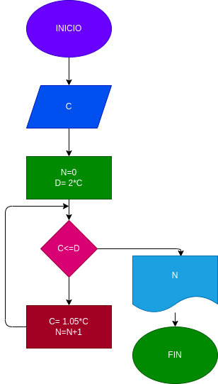

# interes_compuesto
hacer el diagrama de flujo y el programa en python que lea un capital C, y que averigue el prima en cuantos meses se duplica si lo colocan a un interes compuesto del 5% mesual

# analisis

variables de entrada
C = ingrese el capital inicial

variables de proceso
C= 1.05*C
N= N+1

variables de salida
N= numero de meses en total

# DISEÑO
